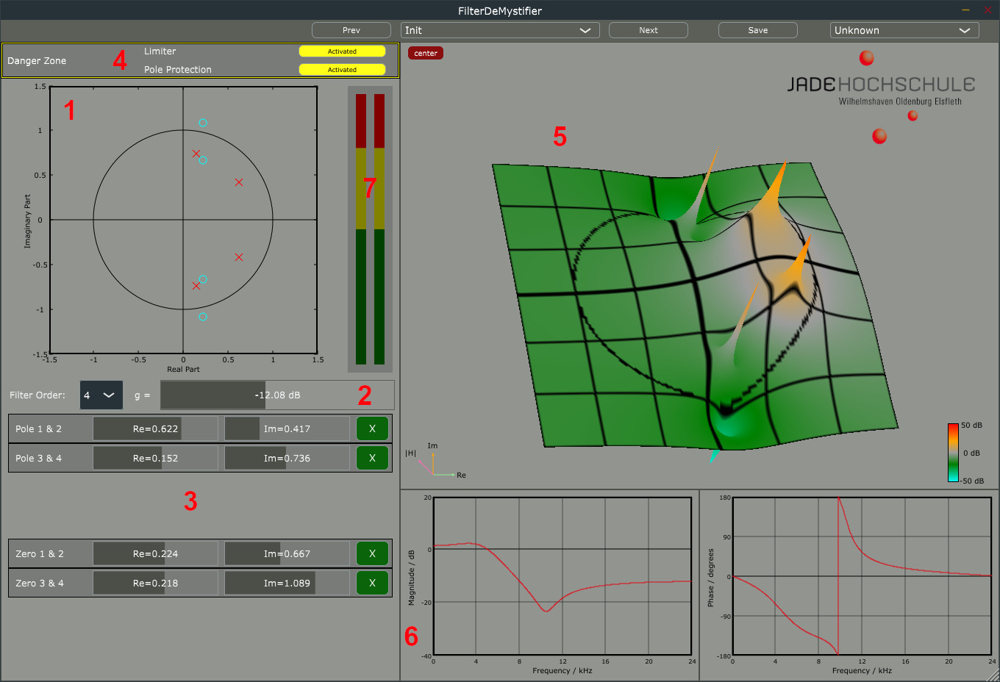

---
author:
- 'License: CC-BY 4.0'
bibliography:
- 'Lit.bib'
date: ', V 0.2., work in progress'
nocite: '[@bristow1994equivalence; @orfanidis1997digital; @pirkle2019designing; @schmidt2010digital; @zolzer2008digital]'
title: 'FilterDeMystifier (FDM) Documentation'
---

WARNING:\
If you switch off both security measures, this plug-in may produce very
loud output signals (unstable filter) and poses a threat to your ears
and gear. It can be fun -- if you know what you're doing. Reduce the
output level in your DAW before trying anything stupid.

Introduction
============

The name of the plug-in is just a funny name as a reminder of the early
days when all plug-ins had an 'er' at the end (e.g. Loudness Maximizer,
DeNoiser). Since filters are nothing but math and more math there are no
mysteries here. However, never forget that we have all of these fabulous
EQs and synthesizers in our DAWs because we are standing on the
shoulders of giants, who started digital signal processing 50+ years
ago. A special thanks goes to the unknown developer of the pzx.dll
plug-in. This was our inspiration.

This plug-in shows how digital filters work on the inside. It is fun to
play and see how a few poles and zeros determine the whole range of
digital filters from cut to peak. From the famous RBJ cookbook to modern
near analogue designs.

Have fun!

Arno, Jannik and Joerg aka audio-dsp.

Installation
============

The downloaded file is a standard zip file. It contains a readme.txt, a
plug-in directory (.vst3) or an AU file (.component) and this manual.
The first step is to copy the directory to the right place for VST3 / AU
files.

Windows
-------

For Windows the standard VST3-directory is:

    c:\Program Files\Common Files\VST3    

Mac VST
-------

If you use the VST3 plugin, copy the .vst3 directory to

    /Users/yourUSERNAME/Library/Audio/Plug-Ins/VST3

Mac AudioUnit
-------------

If you use the AudioUnit plugin, copy the .component file to

    /Users/yourUSERNAME/Library/Audio/Plug-Ins/Components

Linux
-----

For Linux copy the full directory to:

    /home/YourUSERNAME/.vst3/

Preset (De)-Installation
------------------------

After the first launch of the plug-in you will find all presets at the
following location (necessary to remove them after you delete the
plug-in). These are plain xml files.

    Windows:
    C:\Users\yourUSERNAME\AppData\Roaming\Jade Hochschule\FilterDeMystifier

    Mac:
    /Users/yourUSERNAME/Library/Audio/Presets/Jade Hochschule/FilterDeMystifier

    Linux:
    /home/YourUSERNAME/.config/Jade Hochschule/FilterDeMystifier

How to use
==========

{width="0.8\paperwidth"}

FDM consists of three sections: The input parameter part, the output
displays, and a special section for security settings.

Input parameter (1,2,3)
-----------------------

The input section controls the behaviour of the four second order filter
sections and the gain.

### PZ Diagram

The pole-zero diagram with the unit circle is the main user input. Drag
a pole or a zero around. By default, the poles are restricted to remain
within the boundaries of the unit circle to prevent unstable filter
configurations. If you create an odd order filter, the single pole and
single zero can only be dragged along the real axis. Only poles and
zeros in the upper half can be used, the lower half is merely mirroring
the upper half (this is necessary to have real-valued filter
coefficients, and in audio everything is real.)

### Gain

The gain slider allows for gain corrections, if the output is too loud
or too soft.

### PZ List

The slider for the real and imaginary parts of the poles and zeros is an
equivalent user input to the PZ diagram. If your are interested in input
coefficient values, it can be easier to use these sliders or numerical
input.

The filter order combo box allows to change the order of the filter.

Security controls (4)
---------------------

The "Danger Zone" features two buttons to control output signals that
are far too loud for normal usage. The first one applies an internal
brick-wall limiter to the output of the filter sections. This limiter
guarantees output signals below *0dBFS*.

The second button toggles the restriction for every pole radius to be
less than one. Deactivating it will allow for unstable filters. Usually
there would be an audible click followed by silence. In this
implementation the filters are internally restricted by a non-linear
clipping function -- meaning you will hear a loud and very distorted
signal. Since this is very unpleasant, you should only use this setting
with the limiter in place.

Output displays (5,6,7)
-----------------------

Three output displays help you to understand the behaviour of our filter
for given poles and zeros.

### z-Plane Graph

The most important one is the 3D z-plane magnitude graph. It shows the
filter magnitude on the z-plane. All poles increase the magnitude and
all zeros reduce the magnitude. This is visible as spikes and dips in
the z-plane. The graph can be rotated by mouse moves and enlarged by
using the mouse wheel.

### Bode Diagram

The Bode diagram is the classical display of the transfer function of a
filter. The left graph shows the magnitude, and the right graph the
phase response with respect to the frequency. Typically, what you hear
corresponds to what you see in the magnitude because our ears are less
sensitive to phase changes.

If you look carefully you can see that the magnitude is exactly the
height of the circle in the z-plane graph starting on the right side
(zero degrees), if you rotate the display like the pole/zero input
diagram and \"walk\" in counter-clockwise (mathematically positive)
direction around the circle.

### Level meter

The level meter is simply there to check how loud your output will be,
if you listen to it. It shows RMS and peak values.

One simple example
------------------

Start with a second order filter (filter order = 2), put the pole close
to the real axis (x axis) and close to the unit circle. The input signal
will be amplified substantially, since you have put a pole close to the
unit circle. Now move the zero close to the pole and the effect of the
pole is counter-acted. If you move the zero onto the unit circle, the
corresponding frequency is cancelled out completely (notch filter). If
you move the zero outside the unit circle, look at the phase plot. The
phase performs a jump and the final filter is not minimum-phase anymore
(minimum-phase can be a desirable feature, should you want to invert the
filter).

The presets
===========

All presets are designed for a sampling rate of $f_s = 48000$ Hz. The
parameters in this plug-in are all positions on the z-plane. This leads
to normalised filter coefficients, and a different sampling rate will
change the filter sound.

Standard cut filter
-------------------

Several design methods exist for typical cut filter (lowpass, highpass,
bandpass and bandstop). The four best known are:

-   Butterworth: This design is maximally flat at 0 Hz. It is often used
    for loudspeaker filter-banks in its squared version, known as
    Linkwitz-Riley filter.

-   Chebbycheff1: This filter has ripples in the passband, but a steeper
    response for the stopband compared to the Butterworth design

-   Chebbycheff2: This version of the Chebbycheff filter has the ripple
    in the stopband, but is smooth in the passband.

-   Elliptic or Cauer: The last filter design has ripples in both bands.
    It can be used to have a very fast change between pass- and
    stopband.

Audio Filter
------------

For more or less all mixing jobs you need equalisers, and the typical
audio filters are peak and shelving filters.

The peak filter is given by its centre frequency, the desired gain and
the bandwidth (often called Q-factor). The approximation here is not the
result of a typical peak design (RBJ cookbook) but behaves identically.
Especially close to half of the sampling rate, the filter will be
asymmetrical and the overall form does not correspond to the analogue
original. This can be improved by using the design from Orfanidis
[@orfanidis1997digital] or by using analogue prototypes and a
least-squares approach [@schmidt2010digital].

Vocals
------

Typical vocal filters are all-pole filters. Therefore, all zeros are in
the middle $z=0$. The poles are determined by the formant frequencies of
the different vocals. If you want to determine the pole location, look
at a formant list of your choice (e.g.
<https://www.classes.cs.uchicago.edu/archive/1999/spring/CS295/Computing_Resources/Csound/CsManual3.48b1.HTML/Appendices/table3.html>\
) and compute the pole position with a radius close to one.

$$z_1 = 0.99 \exp \left(j\; 2\pi \frac{f_{\mbox{Formant}}}{f_s} \right)$$

The presets include two examples for an /a/, an /i/, and an /e/.

Synthesizer filter (without the non-linear part)
------------------------------------------------

One of the most interesting kinds of filters are the ones for
synthesizers. The approximation here is not very precise or close to the
real filters, since all the non-linearities and the special behaviour
for changing parameters are missing. However, the linear transfer
function is close to the analogue counterparts.

Some signal processing specialities
-----------------------------------

All the filters so far were IIR filters. However, you can build
linear-phase FIR filters as well. The poles must all be in the middle
and therefore have no effect at all. If you now mirror a zero at the
unit circle (one inside, one outside) you get a straight line in the
phase response. It is not possible to have a linear-phase transfer
function with stable IIR filters. Try it out! As long as your poles are
inside the unit circle, you will have a curvy phase response.

Another special filter is a so-called all-pass filter. It does not
change the magnitude at all, but changes the phase. This is a very
versatile tool, if combined in other filter structures. For example you
can use all-pass filters for phasers, filterbanks or decoupled filter
equalisers. To build an all-pass filter you have to mirror all poles
(remember for stable filters, all poles are inside the unit circle) at
the unit circle and put zeros on these mirrored positions.

Boring background: The signal processing stuff
==============================================

If you exclude non-linearities and automation/change of parameters over
time, all standard filters are linear time-invariant systems. Thus, all
of the wonderful LTI signal processing theory applies.

Time-domain difference equation
-------------------------------

A higher-order IIR filter (Infinite Impulse Response) can (but should
not) be implemented directly by using the difference equation
$$\begin{aligned}
    y(n) &=& b_0 x(n) + b_1 x(n-1) + b_2 x(n-2) + \cdots \nonumber\\
    & & - a_1 y(n-1) - a_2 y(n-2) - \cdots\end{aligned}$$

where $b_n$ denote the transversal coefficients and $a_m$ the recursive
coefficients.

Usually, you would implement this equation as second order sections
(SOS) (see this plug-in for reference) and perhaps not in the direct
form 1 -- we use direct form 1 but alternatives could be e.g. a
canonical form like direct form 2 (perhaps not), or ladder structures.

z-plane
-------

By using the z-transform
$${\cal{Z}} \left\{ \cdot \right\} = \sum_{k =  -\infty}^{\infty} (\cdot) z^{-k}$$
you can analyse the difference equation to get the system function
$$H(z) = \frac{b_0 + b_1 z^{-1} +  b_2 z^{-2} + \cdots +  b_{N-1} z^{-(N-1)}}
                  {1 + a_1 z^{-1} +  a_2 z^{-2} + \cdots +  a_{M-1} z^{-(M-1)}}$$
or for the SOS structure (N = M) $$\begin{aligned}
\label{eq:SOS:Zerlegung}
    H(z) &=& \frac{b_0 + b_1 z^{-1} +  b_2 z^{-2} + \cdots +  b_{N-1} z^{-(N-1)}}
                  {1 + a_1 z^{-1} +  a_2 z^{-2} + \cdots +  a_{N-1} z^{-(N-1)}} \\
         & = & g \, \frac{1 + b_{1_1} z^{-1} +  b_{2_1} z^{-2} }{1 + a_{1_1} z^{-1} + a_{2_1} z^{-2}} \, \cdot \,
         \frac{1 + b_{1_2} z^{-1} +  b_{2_2} z^{-2} }{1 + a_{1_2} z^{-1} + a_{2_2} z^{-2}} \, \cdot \nonumber \\
         & & \cdots  \frac{1 + b_{1_K} z^{-1} +  b_{2_K} z^{-2} }{1 + a_{1_K} z^{-1} + a_{2_K} z^{-2}}\end{aligned}$$
where $g$ is the overall gain and $K$ the number of SOS (usually $N/2$
for even order filters).

Poles and Zeros
---------------

By solving the polynomials of the system function you can compute the
poles and zeros (necessary step for constructing the SOS).
$$\begin{aligned}
 H(z)
 & = & g\, \frac{(z-n_0)(z-n_1)\cdots(z-n_{N-1})}{(z-p_0)(z-p_1)\cdots(z-p_{M-1})}\\
 & = & g\, \frac{\displaystyle \prod_{i = 0}^{N-1}(z-n_i)}
 {\displaystyle \prod_{i = 0}^{M-1}(z-p_i)}
 \end{aligned}$$

The positions of the poles and zeros determine the overall behaviour of
the filter. For example, for a stable filter all poles have to be inside
the unit circle (i.e. their distance from the centre must be less than
one). If all zeros and poles are located inside the unit circle the
system is minimum phase. A linear-phase filter has all poles at the
centre of the z-plane, and the zeros are mirrored at the unit circle.
For a stable all-pass filter the poles are mirrored by zeros at the unit
circle.

Further topics
==============

If you want to dive into dsp and filter design this is just the
beginning! Think of quantisation (more details in the book of Zölzer
[@zolzer2008digital]), non-linear and zero-delay filtering ([ book of
Vadim
Zavalishin](https://www.native-instruments.com/fileadmin/ni_media/downloads/pdf/VAFilterDesign_2.1.0.pdf))
or time-variant behaviour (click-free morphing of parameters and filter
designs, e.g. decoupled structures [@regalia1987tunable])

Here is a short list of interesting websites, books and papers for
further reading (and since it cannot include everything, please forgive
us this very subjective list, especially if you do not find your
excellent paper, book, or website here.).

Source code
-----------

This plug-in is open source. you can find the source code here:
(<https://github.com/ArnoSchiller/FilterDeMystifier>)

We are aware that the quality of the code could be improved
significantly. However, if you are familiar with JUCE, you will have no
problem to understand what's going on. Please report issues at the
GitHub repository. Please keep in mind, this started as a student
project for course work.

Web links
---------

<https://webaudio.github.io/Audio-EQ-Cookbook/audio-eq-cookbook.html>\
<https://www.musicdsp.org/>\
<https://www.willpirkle.com/>

Legal stuff
===========

For this documentation the CC-BY 4.0 licence is valid. Copyright holders
are Schiller, Hartog and Bitzer.

-   Microsoft, Windows are trademarks of the Microsoft group of
    companies

-   Mac is a trademark of Apple Inc.

-   VST is a registered trademark of Steinberg Media Technologies GmbH
